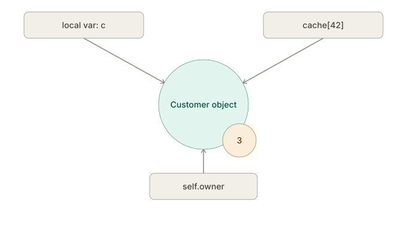
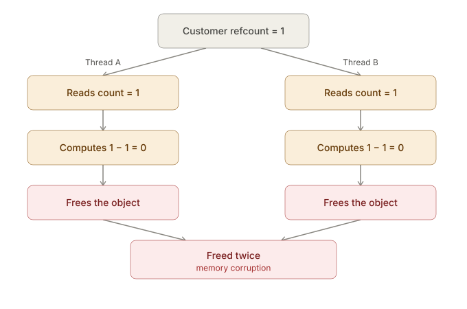
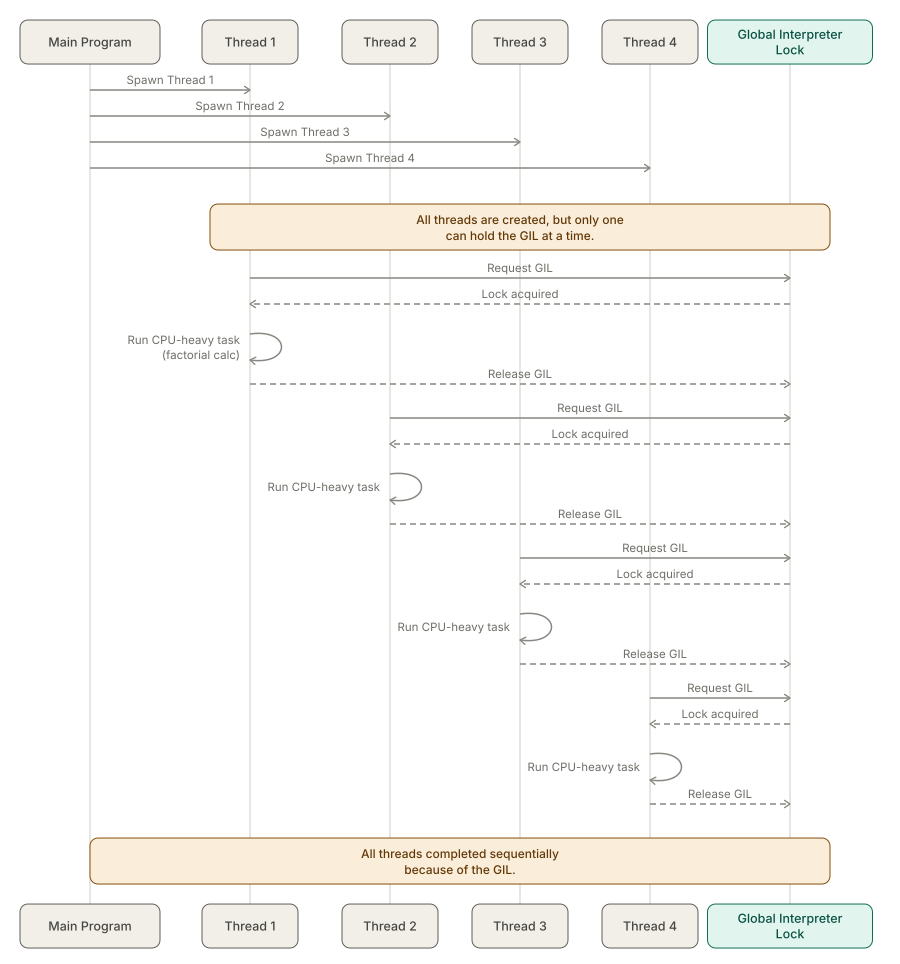
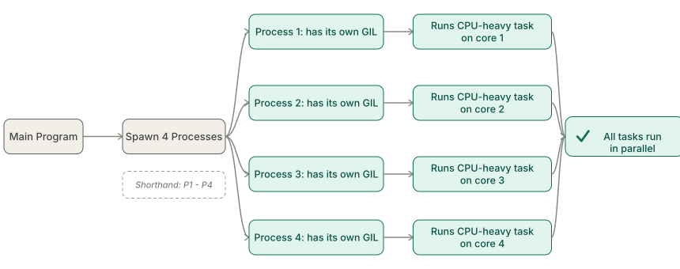
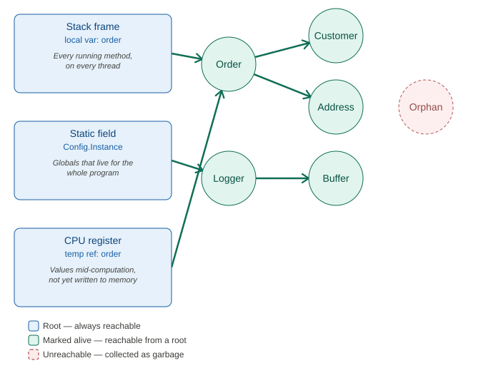
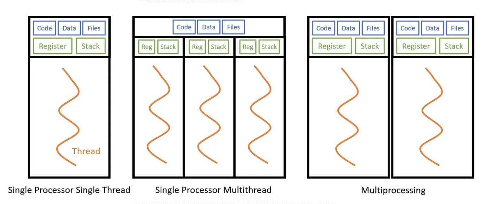

# A Practical Guide to Fast, Concurrent Python

### Agenda:
- GIL (Global interpreter lock) - what is it and how it came to life
- CPU vs I/O bound problems
- Threads vs Processes
- Locks, Semaphores
- asyncio
- No-GIL Python 3.14

## Why do we need GIL?

### Reference counting - Primary garbage collection mechanism



### Race condition it causes



### Locks to the rescue

```python
import threading

counter = 0
lock = threading.Lock()

def increment():
    global counter
    for _ in range(100_000):
        with lock:  # only one thread can be inside this block at a time
            counter += 1

threads = [threading.Thread(target=increment) for _ in range(4)]
for t in threads:
    t.start()
for t in threads:
    t.join()

print(counter)  # always 400_000 — without the lock, this is racy and comes out lower
```

### GIL (Global interpreter lock)

- A thread must acquire the GIL before running any bytecode; if another thread holds it, the requesting thread waits.
- The GIL is released in two scenarios:
  - when a thread executes a blocking I/O operation (network requests, file reads), letting other threads proceed
  - after a fixed switching interval (default 5ms), which forces a context switch to the next waiting thread



**However, multiprocessing sidesteps the GIL entirely:** each process is a separate Python interpreter with its own GIL, so CPU-bound tasks can run in true parallel across multiple cores:



*Further reading: [What is the GIL in Python and why should you care?](https://dev.to/imsushant12/what-is-the-gil-in-python-and-why-should-you-care-1cai)*

---

## Why other languages may not need GIL?

Most other managed languages (C#, Java, etc.) use a **tracing garbage collector**.



---

# Types of perfomance problems

- I/O-bound: API calls, DB queries, file/network reads
- CPU-bound: image resizing, number crunching, parsing/serialization

**I/O bound**

- [Paralelize using threads](#multithreading) - cheaper and faster than processes
- Cache heavily

**CPU bound**

- Because of GIL, spawning multiple threads won't help
- 1st strategy: [**optimize** the code itself](#cpu---optimizing-the-code-without-parallelization)
- 2nd strategy: [paralelize using **processes**](#cpu---paralelize-using-processes)

---

## I/O - Multithreading

### Simple example

```python
from concurrent.futures import ThreadPoolExecutor
import requests

def fetch_url(url):
    response = requests.get(url)  # blocks waiting on the network — GIL is released here
    return response.status_code

urls = get_urls_to_fetch()  # e.g. this returns 37 URLs

with ThreadPoolExecutor(max_workers=len(urls)) as executor:
    executor.map(fetch_url, urls)
```

**Sizing**

```python
urls = get_urls_to_fetch()  # say this returns 37 URLs

with ThreadPoolExecutor(max_workers=len(urls)) as executor:
    executor.map(fetch_url, urls)
```

### Semaphores

- Lock generalized to N permits — bounding concurrency (e.g. "only 5 requests at once")

```python
import os
import requests
from pathlib import Path

session = requests.Session()
if token := os.environ.get("GITHUB_TOKEN"):
    session.headers["Authorization"] = f"Bearer {token}"  # 60/hr -> 5,000/hr

def fetch_repo(full_name: str) -> int:
    r = session.get(f"https://api.github.com/repos/{full_name}", timeout=10)
    r.raise_for_status()
    return r.json()["stargazers_count"]

def fetch_user(login: str) -> int:
    r = session.get(f"https://api.github.com/users/{login}", timeout=10)
    r.raise_for_status()
    return r.json()["public_repos"]

if __name__ == "__main__":
    repos = Path("data/repos.txt").read_text(encoding="utf-8").split()
    users = Path("data/users.txt").read_text(encoding="utf-8").split()
    print(f"{len(repos)} repos + {len(users)} users to fetch")
```

**Scenario 1 — as many threads as possible:**

```python
from concurrent.futures import ThreadPoolExecutor

# ... inside if __name__ == "__main__":

# One thread per name, no cap — fires every request at once, regardless
# of what GitHub actually allows
with ThreadPoolExecutor(max_workers=len(repos) + len(users)) as executor:
    futures = [executor.submit(fetch_repo, name) for name in repos]
    futures += [executor.submit(fetch_user, login) for login in users]
    results = [f.result() for f in futures]
    # requests.exceptions.HTTPError: 403 Client Error: rate limit exceeded
    # — unauthenticated that's 60 requests, so it fails almost immediately
```

**Scenario 2 — retry when we get told off:**

```python
import time
import requests

def call_with_retry(fn, arg, max_attempts=5):
    for attempt in range(max_attempts):
        try:
            return fn(arg)
        except requests.HTTPError as e:
            if e.response.status_code not in (403, 429):
                raise
            # GitHub sends retry-after — honour the server's number instead
            # of guessing with exponential backoff
            time.sleep(int(e.response.headers.get("retry-after", 2 ** attempt)))
    raise RuntimeError(f"{fn.__name__} still limited after {max_attempts} attempts")

# executor.submit passes any extra args straight through to the callable
with ThreadPoolExecutor(max_workers=len(repos) + len(users)) as executor:
    futures = [executor.submit(call_with_retry, fetch_repo, n) for n in repos]
    futures += [executor.submit(call_with_retry, fetch_user, u) for u in users]
    results = [f.result() for f in futures]
    # Correct, but wasteful — every rejected call still costs a round trip,
    # and we only discover we were going too fast after being told off
```

**Scenario 3 — size a semaphore to the documented concurrency limit:**

```python
import threading

# GitHub documents "no more than 100 concurrent requests" — stay well under it.
# One semaphore shared by both operations, because the limit is per account.
MAX_CONCURRENT = 10
semaphore = threading.Semaphore(MAX_CONCURRENT)

def call_limited(fn, arg):
    with semaphore:  # the 11th caller blocks here until a permit frees up
        return call_with_retry(fn, arg)

with ThreadPoolExecutor(max_workers=len(repos) + len(users)) as executor:
    futures = [executor.submit(call_limited, fetch_repo, n) for n in repos]
    futures += [executor.submit(call_limited, fetch_user, u) for u in users]
    results = [f.result() for f in futures]
```

**The semaphore does not replace the retry — it composes with it.** 

---

## CPU - Optimizing the code (Without Parallelization)

Before reaching for threads or processes, it's often cheaper — and simpler — to just make the single-threaded code faster:

- **Swap list membership checks for set/dict lookups** — `x in my_list` is O(n): every check can scan the whole list. `x in my_set` (or `x in my_dict`) is O(1) via hashing.

```python
needle = "z"  # the value we're checking for membership

# O(n) per check — scans the whole list every time
allowed = ["a", "b", "c", "..."]
if needle in allowed:
    ...

# O(1) per check — same logic, hash lookup instead of a scan
allowed = {"a", "b", "c", "..."}
if needle in allowed:
    ...
```

- **`io.StringIO` for building strings in a loop** — strings are immutable, so repeated `+=` allocates a brand-new string and copies the old contents in every time (quadratic). `io.StringIO` gives you a mutable buffer to write into instead.

```python
import io

# Quadratic — each += allocates a new string and copies everything so far into it
result = ""
for chunk in chunks:
    result += chunk

# Linear — StringIO writes into a buffer; one final allocation via getvalue()
buf = io.StringIO()
for chunk in chunks:
    buf.write(chunk)
result = buf.getvalue()
```

- **Reach for libraries that drop into C under the hood** — NumPy (and similarly Pandas, Cython-based libraries) do the actual number crunching in compiled C over contiguous memory, sidestepping the per-element bytecode dispatch and refcounting overhead of a Python loop entirely.

```python
import numpy as np

# Pure Python — one bytecode dispatch, refcount bump, etc. per element
squares = [x * x for x in range(1_000_000)]

# NumPy — the loop runs once, in C, over a contiguous buffer
squares = np.arange(1_000_000) ** 2
```

---

## CPU - Paralelize using processes

```python
from concurrent.futures import ProcessPoolExecutor

def crunch_numbers(n):
    return sum(i * i for i in range(n))  # simulate CPU-bound work

with ProcessPoolExecutor(max_workers=4) as executor:
    results = list(executor.map(crunch_numbers, [10_000_000] * 10))
```

**Sizing**
```python
import os
from concurrent.futures import ProcessPoolExecutor

def crunch_numbers(n):
    return sum(i * i for i in range(n))  # simulate CPU-bound work

# Unlike threads, more processes than CPU cores doesn't buy more
# parallelism — they'd just compete for the same cores.
# os.cpu_count() counts logical cores, so hyperthreaded siblings are
# included — for CPU-bound work they're worth well under a full core each.
available_cores = os.cpu_count() or 1
worker_count = max(1, available_cores - 1)  # leave a core for the OS/main process

with ProcessPoolExecutor(max_workers=worker_count) as executor:
    results = list(executor.map(crunch_numbers, [10_000_000] * 10))
```
**Kubernetes example** - pass cpu cores as environment variable

```yaml
env:
  - name: CPU_LIMIT
    valueFrom:
      resourceFieldRef:
        resource: limits.cpu
        divisor: "1"      # rounds fractional limits UP to whole cores
```

**Spawning more processes also increases RAM usage, be careful not to run out of memory.**

--- 

# Threads vs Processes summary

| Feature | Threads | Processes |
|---|---|---|
| Memory | Shared within the same process | Separate, isolated memory spaces |
| Best For | I/O-bound tasks | CPU-bound tasks |
| Execution | Concurrency (context switching) | Parallelism (true simultaneous execution) |
| GIL Impact | Limited by single GIL per process | Each process has its own GIL |
| Overhead | Low (lightweight) | High (heavier resource usage) |
| Communication | Direct memory access (easier) | Pipes/queues (more complex) |
| Robustness | Lower (crash affects whole process) | Higher (isolation prevents cascade failure) |



--- 

# asyncio

- library for writing concurrent code using the familiar **async/await** syntax
- great for **high-volume I/O** operations
- uses **single-threaded** event loop, removing the need for creating and switching between threads

```python
import asyncio
import httpx

async def fetch_url(client, url):
    response = await client.get(url)  # yields control back to the loop while waiting
    return response.status_code

async def main():
    urls = get_urls_to_fetch()  # e.g. this returns 37 URLs
    async with httpx.AsyncClient() as client:
        # all 37 requests are in flight concurrently — on one thread
        return await asyncio.gather(*(fetch_url(client, u) for u in urls))

asyncio.run(main())
```

Same idea as the threading version — only the flavour of the primitive changes:

```python
import asyncio
import httpx

MAX_CONCURRENT = 10

async def fetch_limited(semaphore, client, url):
    async with semaphore:  # the 11th caller awaits here until a permit frees up
        return await fetch_url(client, url)

async def main():
    urls = get_urls_to_fetch()
    # Created inside main() so it belongs to the loop that asyncio.run() starts
    semaphore = asyncio.Semaphore(MAX_CONCURRENT)
    async with httpx.AsyncClient() as client:
        return await asyncio.gather(
            *(fetch_limited(semaphore, client, u) for u in urls)
        )

if __name__ == "__main__":
    results = asyncio.run(main())
```

Note there's no pool size to tune here. With threads, `max_workers` doubles as both
the concurrency cap and the resource budget; with asyncio the semaphore is the only
cap you need, because the tasks themselves are nearly free.


| | Threads | asyncio |
|---|---|---|
| Concurrency unit | OS thread (MBs of stack) | coroutine (bytes on the heap) |
| Switching | done by the kernel | managed inside python code |
| Practical ceiling | hundreds → low thousands | tens of thousands+ |
| Works with sync libraries | yes, unchanged | no — needs async-native clients |
| Blocking call impact | that thread only | stalls *every* task |
| CPU-bound work | still GIL-limited | still GIL-limited (use processes) |


*Further reading:*
- [Deep Dive into Multithreading, Multiprocessing, and Asyncio](https://medium.com/data-science/deep-dive-into-multithreading-multiprocessing-and-asyncio-94fdbe0c91f0)
- [Demystifying AsyncIO: Building Your Own Event Loop in Python — Arthur Pastel](https://www.youtube.com/watch?v=Ww2HBNpu98g)

---

## Free-Threaded Python (3.14)

- **Two refcount fields instead of one, plus an owning-thread id.** The thread that owns an object updates its *local* count with plain, non-atomic writes; other threads touch a separate *shared* count. Because only one thread ever writes the local field, the common case needs **no locking and no atomic instructions** at all — the true refcount is the sum of the two.
- **Containers get per-object locks, not a global one.** Each `dict`, `list`, and `set` carries its own fine-grained lock, so two threads mutating two different dicts never contend with each other. Contention is now scoped to the specific object being shared, not to the entire interpreter.
- **GC pauses.** Cyclic garbage collection can no longer rely on the GIL to hold the object graph still, so it now does **two brief stop-the-world pauses** to get a consistent view. Short, but they exist — unlike the classic build, where the collector simply ran under the GIL.
- **Requires compatible dependecies**. Any C extension that isn't explicitly marked thread-safe **re-enables the GIL for the whole process** when it's imported. 
- Free-threading is what eventually makes `ThreadPoolExecutor` the right answer for *both* kinds of workload.